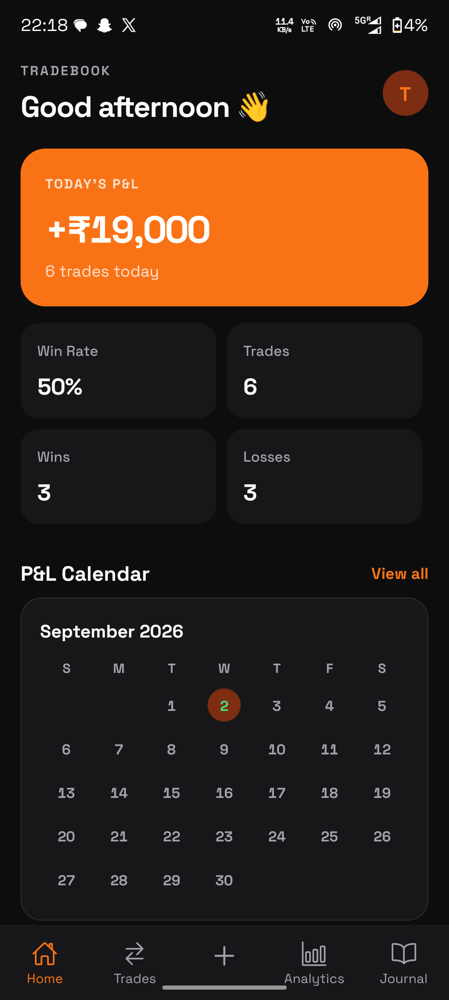
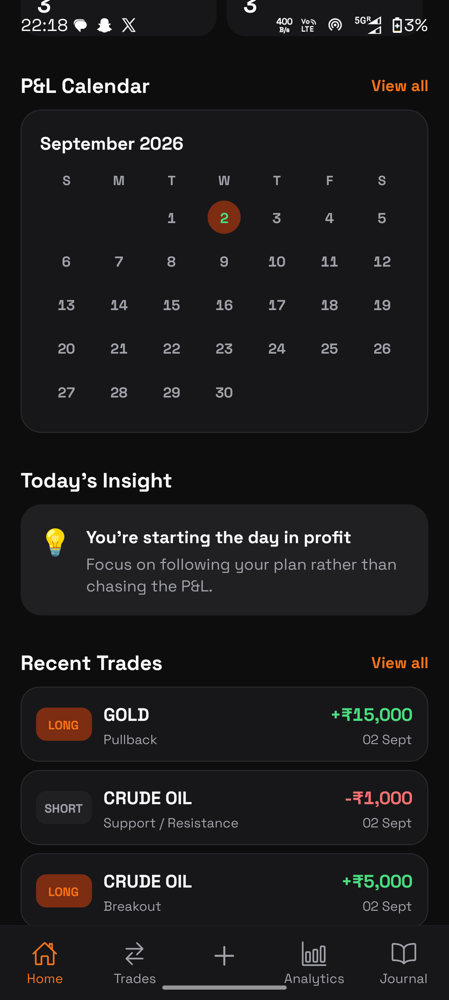
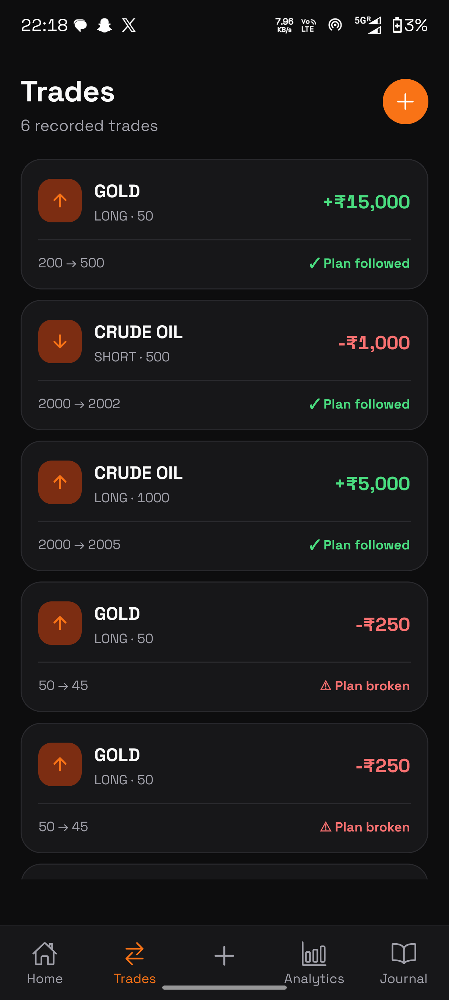
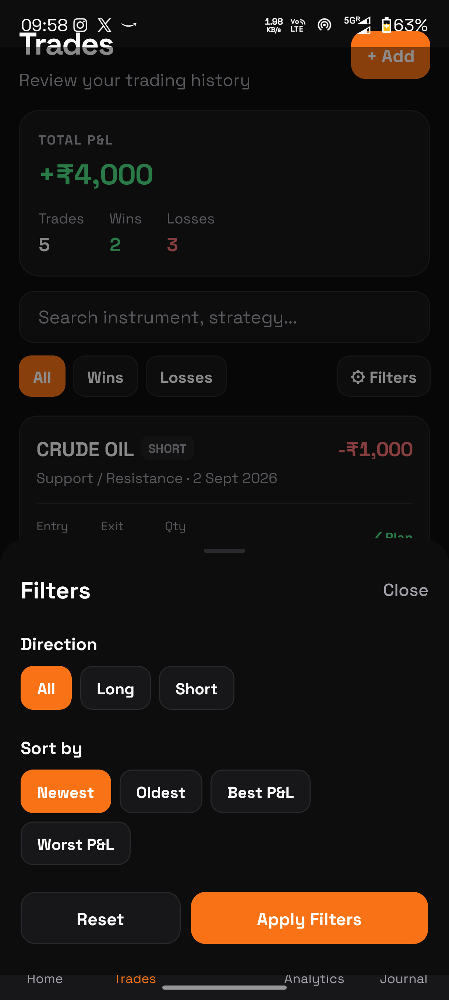
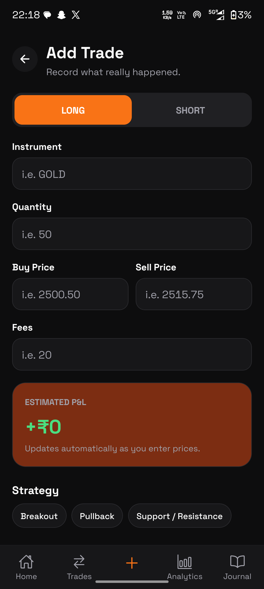
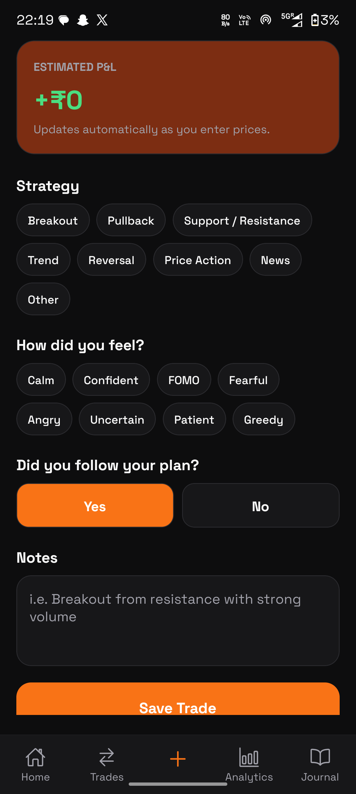
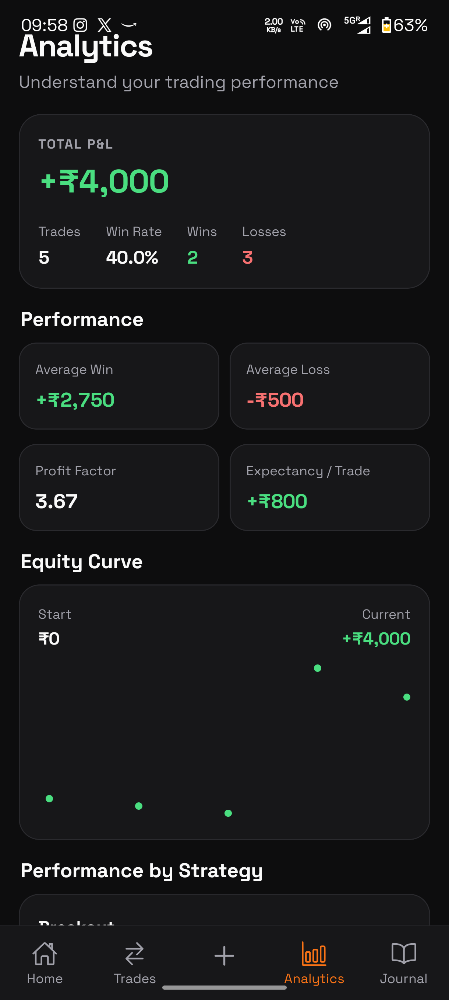
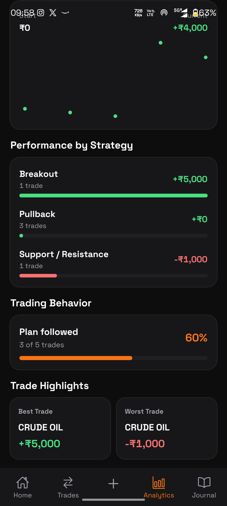

<h1>📸 Application Walkthrough</h1>
<table>
  <!-- Headers Row 1 -->
  <tr>
    <td align="center" width="33.33%"><b>Dashboard (Main View)</b></td>
    <td align="center" width="33.33%"><b>Dashboard (Scrolled)</b></td>
  </tr>
  <!-- Images Row 1 -->
  <tr>
    <td></td>
    <td></td>
  </tr>
  <!-- Headers Row 2 -->
  <tr>
    <td align="center"><b>Trades list</b></td>
    <td align="center"><b>Trade Filters</b></td>
  </tr>
  <!-- Images Row 2 -->
  <tr>
    <td></td>
    <td></td>
  </tr>
  <!-- Headers Row 3 -->
  <tr>
    <td align="center"><b>Add Trade Form</b></td>
    <td align="center"><b>Add Trade Scrolled</b></td>
  </tr>
  <!-- Images Row 3 -->
  <tr>
    <td></td>
    <td></td
  </tr>
  <!-- Headers Row 4 -->
   <tr>
    <td align="center"><b>Analytics</b></td>
    <td align="center"><b>Analytics Scrolled</b></td>
  </tr>
  <!-- Images Row 4 -->
  <tr>
    <td></td>
    <td></td>
  </tr>
</table>

---

# Welcome to your Expo app 👋

This is an [Expo](https://expo.dev) project created with [`create-expo-app`](https://www.npmjs.com/package/create-expo-app).

## Get started

1. Install dependencies

   ```bash
   npm install
   ```

2. Start the app

   ```bash
   npx expo start
   ```

In the output, you'll find options to open the app in a

- [development build](https://docs.expo.dev/develop/development-builds/introduction/)
- [Android emulator](https://docs.expo.dev/workflow/android-studio-emulator/)
- [iOS simulator](https://docs.expo.dev/workflow/ios-simulator/)
- [Expo Go](https://expo.dev/go), a limited sandbox for trying out app development with Expo

You can start developing by editing the files inside the **app** directory. This project uses [file-based routing](https://docs.expo.dev/router/introduction).

## Get a fresh project

When you're ready, run:

```bash
npm run reset-project
```

This command will move the starter code to the **app-example** directory and create a blank **app** directory where you can start developing.

## Learn more

To learn more about developing your project with Expo, look at the following resources:

- [Expo documentation](https://docs.expo.dev/): Learn fundamentals, or go into advanced topics with our [guides](https://docs.expo.dev/guides).
- [Learn Expo tutorial](https://docs.expo.dev/tutorial/introduction/): Follow a step-by-step tutorial where you'll create a project that runs on Android, iOS, and the web.

## Join the community

Join our community of developers creating universal apps.

- [Expo on GitHub](https://github.com/expo/expo): View our open source platform and contribute.
- [Discord community](https://chat.expo.dev): Chat with Expo users and ask questions.

---

### Remaining features
1.  Phase 2 — Journal & behavior
- Journal ↔ Trades integration ← next
- Daily Review
- Playbook rule tracking
- Discipline streaks
2.  Phase 3 — Data portability
- Export trades to Excel
- Export trades to PDF
- Import/restore local backup
- Backup/restore architecture
3.  Phase 4 — Google account & cloud backup
- Google authentication
- Google Drive connection
- Automatic Drive backup
- Manual Backup Now
- Restore from Drive
- Backup conflict/error handling
- Sign-out/account state
4.  Phase 5 — Final polish
- Loading states
- Error states
- Empty states
- Dark/light theme consistency
- Navigation review
- Touch-target/accessibility review
- Small-screen layout review
- Long-text handling
- Final TypeScript/build check
- Production-readiness review
